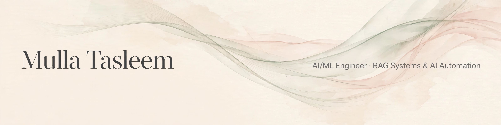

  

  
  

## 🌱 About me

BTech in AI/ML (Vignan, '26) — learning AI by building with it, in public. 🔨

I didn't wait until I "knew enough" to start building. I started learning and building at the same time, and everything here taught me something no tutorial could.

## 🛠️ Tech I build with

## 📊 GitHub stats

  
  

  
  

  

<picture>
  <source media="(prefers-color-scheme: dark)" srcset="https://raw.githubusercontent.com/mullatasleem/mullatasleem/output/github-snake-dark.svg" />
  <source media="(prefers-color-scheme: light)" srcset="https://raw.githubusercontent.com/mullatasleem/mullatasleem/output/github-snake.svg" />
  
</picture>

## 📌 Featured projects

### 🔍 [Hybrid Fake News Detection](https://github.com/mullatasleem/hybrid-fake-news-detection)

ML + deep learning ensemble — **99.01% accuracy** on the ISOT dataset with a GRU pre+post padding fusion model. Presented at ICAN 2026, Chitkara University.

### 🚧 EdgeTour-RAG *(building now)*

An edge-optimized RAG system for tourism + civic hazard routing (hybrid retrieval, quantized local LLMs, prompt compression). Documenting the whole build in public.

## 📫 Find me

  

DMs open — especially if you're learning too 👀
